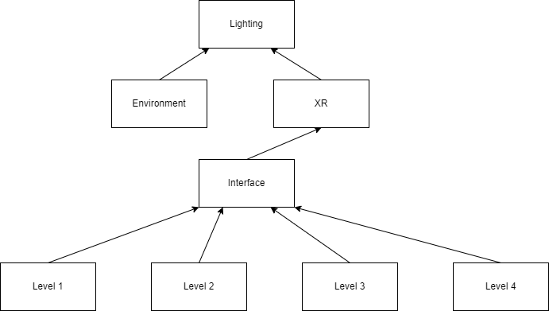

# EscapeRoomVR
Egy VR játék amelyet az Önálló laboratórium tárgyra készítettem el. 4 szobából áll, mindegyik egy másik kihívást tartogat a játékos számára.

*Konzulens: Hideg Attila*

# Dokumentáció

Alapvetően a játék a következő komponensekből épül fel:
- Lighting
- Interface
- Environment
- XR
- Level 1
- Level 2
- Level 3
- Level 4

A következőkben ezen komponenseket szeretném részletesebben kifejteni, illetve a hozzájuk kapcsolodó szkripteket elmagyarázni.



## Lighting

A játék megvilágításáért felelős, mndegyik GameObject függ tőle. A program alapvetően Mixed megvilágítást használ, a statikus objektumok Baked Lighting-al jelennek meg (lényegében már fordítási időben legenerálódnak az árnyékok, "beleégnek" az objektumokba), illetve Real-time megvilágítást használnak az interaktálható, dinamikus objektumok. Ezzel is a teljesítményt növeljük. Van egy Directional Light, illetve ezen kívül néhány Spot / Point Light ami vagy az egyes objektumok funkcionalítását adja vagy az egyes szobák megvilágításáért felelős.

## Environment

Alapvetően csak a külső atmoszféra megteremtéséért felelős. Fontos, hogy alacsony vertex-számú GameObjectek alkotják, hogy ezzel is a teljesítményt növelni tudjuk.

## Interface

Ennek a komponensek több fontos feladata is van:
- A játékba való betöltéskor átvezetés (5 másodperc alatt kerülünk sötétségből a virtuális világba)
  
  Ez a FadeCanvas szkript segítségével történik
  ```C#
private IEnumerator FadeIn(float duration)
{
    float elapsedTime = 0.0f;

    while (alpha <= 1.0f)
    {
        SetAlpha(elapsedTime / duration);
        elapsedTime += Time.deltaTime;
        yield return null;
    }
}

private IEnumerator FadeOut(float duration)
{
    float elapsedTime = 0.0f;

    while (alpha >= 0.0f)
    {
        SetAlpha(1 - (elapsedTime / duration));
        elapsedTime += Time.deltaTime;
        yield return null;
    }
}
  
